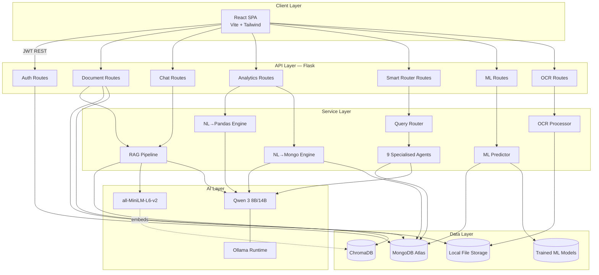
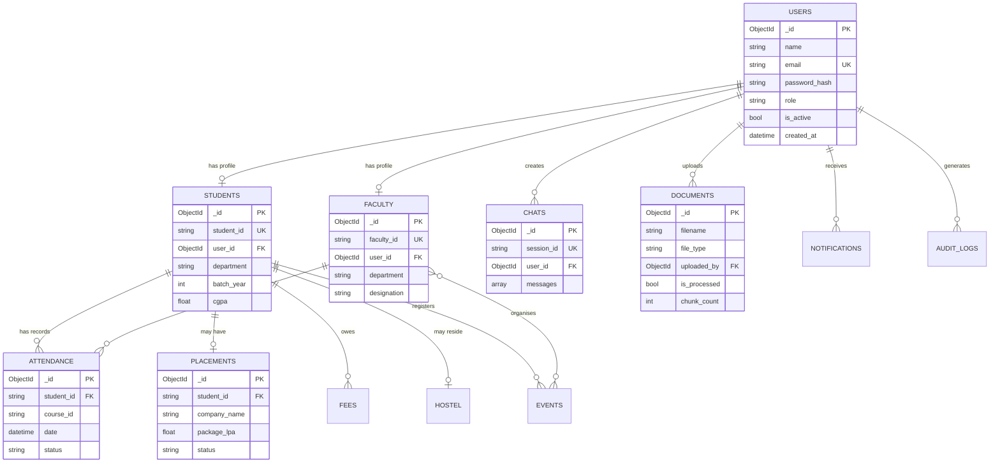
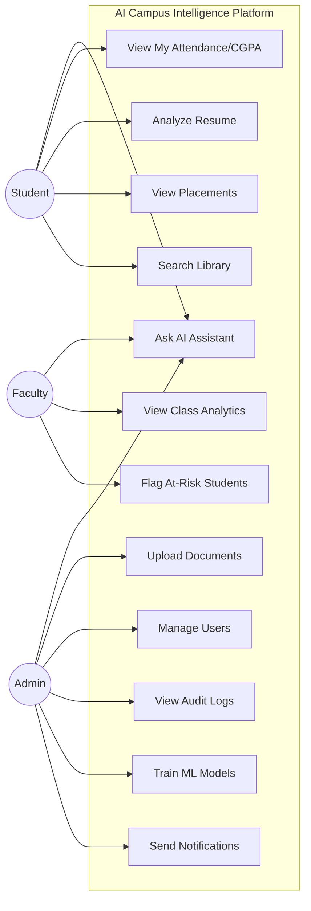
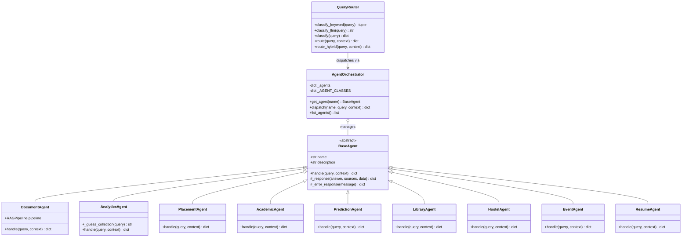
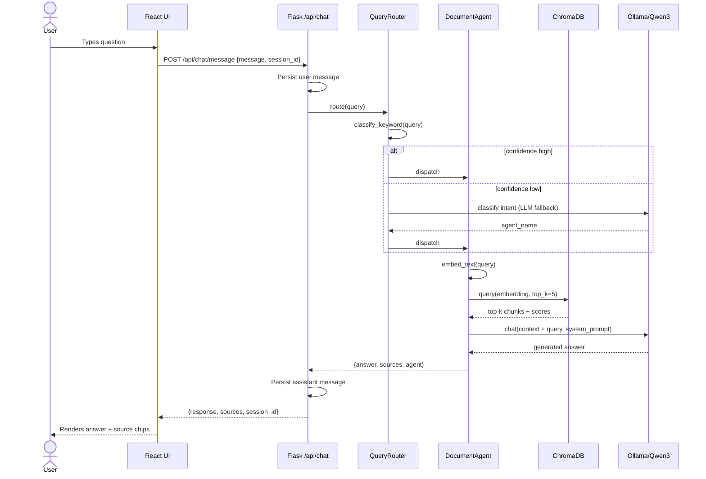
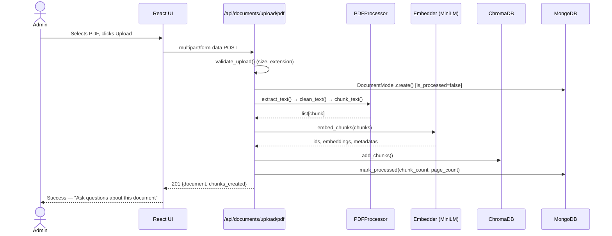

# System Diagrams

All diagrams are in [Mermaid](https://mermaid.js.org/) syntax — render natively on
GitHub, or paste into [mermaid.live](https://mermaid.live).

---

## 1. Architecture Diagram

---

## 2. Entity-Relationship Diagram

---

## 3. Use Case Diagram

---

## 4. Class Diagram — Agent System (Phase 8)

---

## 5. Sequence Diagram — RAG Chat Flow

---

## 6. Sequence Diagram — Document Upload & Indexing

